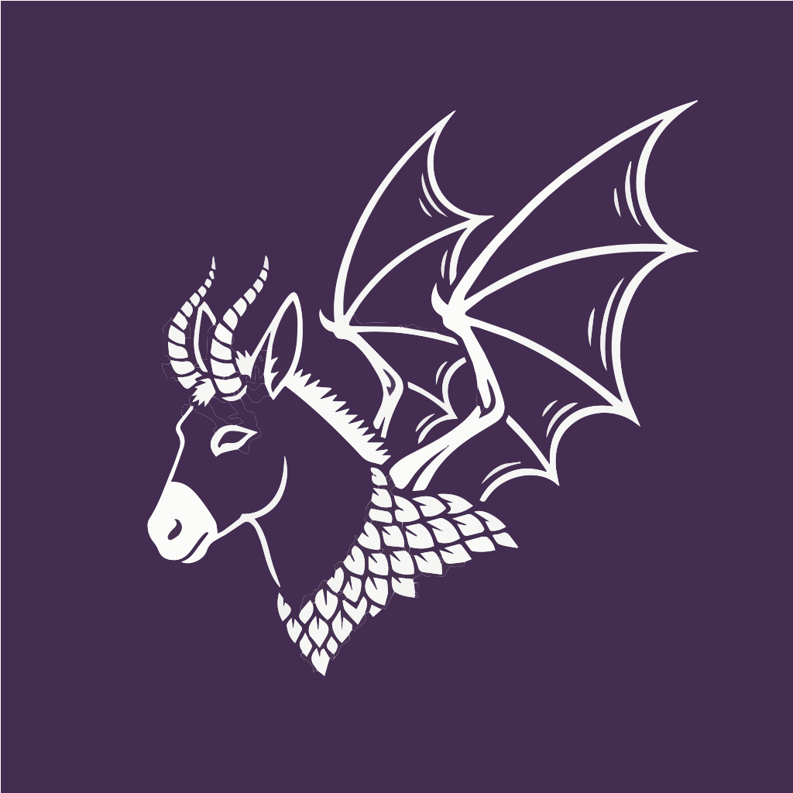

# Dong-A-Deuce

<p align="center">
  
</p>

A lightweight, cross-platform MTG Commander game client built with Kotlin and Compose Multiplatform.

## Features (Planned)

- **Commander-focused**: Designed specifically for EDH/Commander format
- **P2P Networking**: Host or join games directly, no central server needed
- **Deck Import**: Load decks from text format
- **Cross-platform**: Runs on Windows, macOS, and Linux

## Project Structure

```
dongadeuce/
├── shared/              # Shared game logic and models
│   ├── models/         # Card, Deck, GameState, Player, Zone
│   ├── network/        # P2P networking protocol (TODO)
│   └── game/           # Game logic, deck parser
├── desktop/            # Compose Desktop UI
│   ├── ui/             # UI components (game screen, zones, cards)
│   ├── viewmodel/      # ViewModels with StateFlow (MVVM architecture)
│   ├── client/         # Network client (TODO)
│   └── server/         # Network server/host (TODO)
└── resources/          # Card images cache (TODO)
```

## Architecture

This project follows the **MVVM (Model-View-ViewModel)** pattern:

- **Models** (`shared/models/`): Domain objects like Card, Deck, Player, GameState
- **ViewModels** (`desktop/viewmodel/`): Manage UI state with Kotlin StateFlow
  - `GameViewModel`: Manages game state, player actions, card movements
  - `MenuViewModel`: Handles menu navigation, deck loading, lobby management
- **Views** (`desktop/ui/`): Composable UI components that observe ViewModel state

Benefits:
- Clean separation of concerns
- Testable business logic
- Reactive state management with StateFlow
- Easy to integrate P2P networking (ViewModels handle network events)

## Building and Running

### Prerequisites
- JDK 11 or higher
- Gradle (wrapper included)

### Run the application
```bash
cd dongadeuce
./gradlew desktop:run
```

### Build distributions
```bash
# macOS .dmg
./gradlew desktop:packageDmg

# Windows .msi
./gradlew desktop:packageMsi

# Linux .deb
./gradlew desktop:packageDeb
```

## Current Status (v2.17.0)

**Hotseat Mode:** 95% Complete - Fully Playable! ✅
**Network Mode:** 5% Complete - UI Only ⏳

### ✅ Fully Implemented

**Core Gameplay:**
- **Turn/Phase System** - Full MTG phase cycle with visual indicator
- **Commander Damage Tracking** - Complete UI with 21-damage lethal detection
- **Card Context Menus** - Right-click menus for all zones with comprehensive actions
- **Library Search** - Full search/filter dialog with card manipulation
- **Zone Viewers** - Interactive dialogs for graveyard, exile, command zone
- **Drag-and-Drop Battlefield** - Grid-based card positioning system
- **Card Images** - Async loading with 500MB+ offline cache
- **Tap/Untap** - Double-click and context menu support
- **Counters** - Add/remove +1/+1, charge, and custom counters
- **Card Attachments** - Aura/Equipment attachment system
- **Flip Cards** - Full flip card support
- **Life Tracking** - Automatic loss detection
- **Draw from Empty Library** - Automatic loss detection
- **All Zone Operations** - Move cards between any zones
- **Library Operations** - Draw, mill, shuffle, search, tutor, mulligan
- **Multi-Card Selection** - Shift+click to select multiple cards
- **Batch Operations** - Right-click applies actions to all selected cards
- **Card Stacking** - Grid-based stacking system (max 3 cards per stack)
- **Token Creation** - Create tokens via Scryfall search with custom P/T
- **Drag-and-Drop to Zones** - Drag cards from battlefield to Library/Graveyard/Exile buttons
- **Battlefield Scrolling** - Vertical scrolling for cards placed in lower rows
- **Give Control** - Transfer control of permanents between players

**Hotseat Multiplayer:**
- **2-4 Player Support** - Full local multiplayer
- **Per-Player Deck Loading** - Each player loads their own deck
- **Automatic Player Rotation** - UI rotates to show active player
- **Hand Privacy** - Only active player sees their cards
- **Turn Passing** - Automatic player advancement
- **Zone Access Control** - Only active player can interact

**Technical:**
- MVVM architecture with StateFlow
- Scryfall API integration
- Bulk card cache with progress UI
- Text-based deck parser
- 44 passing unit tests
- Comprehensive input validation

### ❌ Not Yet Implemented

**Missing Features:**
- **Game Log/History** - No action history (2-3 days work)
- **Commander Tax Tracking** - Manual tracking required (1 day work)
- **Network Multiplayer Backend** - UI exists but no server/client (3-4 weeks work)
- **Keyboard Shortcuts** - All actions require mouse
- **Copy/Clone Cards** - No support for card copying effects

### Completion Status
- **Hotseat Mode:** ~95% complete (playable, missing game log + commander tax)
- **Network Mode:** ~5% complete (UI only, no backend)

## Tech Stack

- **Kotlin**: Primary language
- **Compose Multiplatform**: Cross-platform UI framework
- **Ktor**: Networking (server + client)
- **kotlinx.serialization**: JSON serialization for network protocol
- **Scryfall API**: Card data and images (planned)

## Game Zones

The UI includes all Commander zones:
- **Command Zone**: Your commander
- **Library**: Draw deck
- **Hand**: Cards in hand
- **Battlefield**: Permanents in play
- **Graveyard**: Discarded/destroyed cards
- **Exile**: Exiled cards
- **Stack**: Spells/abilities being resolved (not visible yet)

## Next Steps

See [TODO.md](TODO.md) for detailed development roadmap.

### Immediate Priorities (v2.18.0 - 1 week)
1. **Game Log/History System** - Track all game actions for review (2-3 days)
2. **Commander Tax Tracking** - Automatic tax calculation (1 day)
3. **Keyboard Shortcuts** - Speed up common actions (1 day)

**Result:** Feature-complete hotseat multiplayer

### Medium Term (v2.19.0 - 1-2 weeks)
4. Settings/Preferences - Player name persistence, defaults
5. Copy/Clone Cards - Support for card copying effects
6. Animations - Card movement and tap animations
7. Sound Effects - Audio feedback for actions

**Result:** Polished hotseat experience

### Long Term (v3.0.0 - 3-4 weeks)
8. **Network Multiplayer Backend** - The big one
   - GameServer.kt with Ktor WebSockets
   - GameClient.kt with Ktor WebSockets
   - GameMessage.kt network protocol
   - State synchronization
   - Integration with ViewModels
9. Chat System - In-game chat with commands
10. Spectator Mode - Watch games in progress

**Result:** Full network multiplayer

