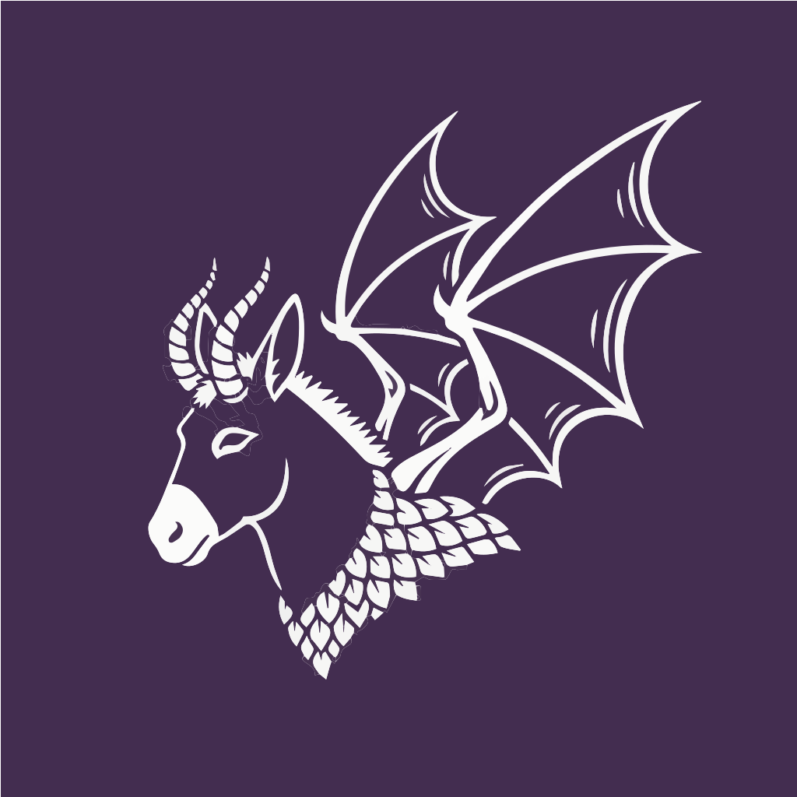

# Dong-A-Deuce

<p align="center">
  
</p>

A lightweight, cross-platform MTG Commander game client built with Kotlin and Compose Multiplatform.

[](https://www.linkedin.com/in/dustinmcafee/)

**Support this project:**

[](https://github.com/sponsors/dustinmcafee)
[](https://paypal.me/dustinmcafee)
[](https://buymeacoffee.com/dustinmcafee)
[](#crypto-donations)
[](#crypto-donations)
[](#crypto-donations)
[](#crypto-donations)

<details>
<summary id="crypto-donations">Crypto Donations</summary>

**Bitcoin (BTC)**
```
3QVD3H1ryqyxhuf8hNTTuBXSbczNuAKaM8
```

**Ethereum (ETH)**
```
0xaFE28A1Dd57660610Ef46C05EfAA363356e98DC7
```

**Solana (SOL)**
```
6uWx4wuHERBpNxyWjeQKrMLBVte91aBzkHaJb8rhw4rn
```

**Monero (XMR)**
```
8C5aCs7Api3WE67GMw54AhQKnJsCg6CVffCuPxUcaKoiMrnaicyvDch8M2CXTm1DJqhpHKxtLvum9Thw4yHn8zeu7sj8qmC
```

</details>

## Features

- **Commander-focused**: Designed specifically for EDH/Commander format
- **Hotseat Multiplayer**: 2-6 players on the same device
- **Network Multiplayer**: Host or join games over LAN, or connect to a dedicated server (2-6 players)
- **Dedicated Server**: Run on Android (foreground service) or JVM, with self-signed TLS encryption (TOFU)
- **Multi-format Deck Import**: Load decks from Cockatrice (.cod), .dec, .dek, .txt, .mwDeck formats
- **Clipboard Paste**: Paste deck lists directly from clipboard on desktop and Android
- **Commander Selection**: Interactive dialog when importing decks without explicit commander
- **Cross-platform**: Runs on Windows, macOS, Linux, and Android
- **Offline Card Cache**: 500MB+ Scryfall bulk data for instant deck loading
- **Settings Persistence**: Player name, server mode, TLS toggle, and network settings saved between sessions
- **Keyboard Shortcuts**: 120+ shortcuts for fast gameplay
- **Mana Pool Tracking**: Full WUBRG+C mana counters with +/-/set-exact on both platforms
- **Resizable Game Layout**: Drag handles to resize opponent area, battlefield, command zone, and hand

## Download & Install

Download the latest release from [GitHub Releases](https://github.com/dustinmcafee/dongadeuce/releases/latest).

### Windows
1. Download `Commander.MTG-X.X.X.msi`
2. Run the installer
3. Launch "Commander MTG" from the Start Menu

*Or download `dongadeuce-windows-X.X.X.jar` and run with `java -jar dongadeuce-windows-X.X.X.jar`*

### macOS
1. Download `Commander.MTG-X.X.X.dmg`
2. Open the DMG and drag to Applications
3. Launch from Applications folder

*First launch: Right-click → Open to bypass Gatekeeper*

### Linux
**Debian/Ubuntu:**
```bash
sudo dpkg -i dong-a-deuce_X.X.X_amd64.deb
dong-a-deuce
```

**Other distributions:**
```bash
java -jar dongadeuce-windows-X.X.X.jar
```

### Android
Android APK builds are available from GitHub Releases. Full touch support with drag-and-drop battlefield, gesture-based card interactions, and feature parity with the desktop version.

### First Run
1. Click "Download Cache" to get card data (~500MB, one-time)
2. Load a deck file (examples included in repo)
3. Start a hotseat or network game

## Project Structure

```
dongadeuce/
├── shared/                  # Shared game logic and models (Kotlin Multiplatform)
│   ├── models/              # Card, Deck, GameState, Player, Zone, CardAction, GameEvent
│   ├── network/             # GameEngine, GameServer, GameClient, protocol messages
│   ├── server/              # GameRoom, LobbyManager, ServerConfig
│   ├── viewmodel/           # GameViewModel, MenuViewModel (shared state management)
│   ├── tls/                 # TLS config, cert generation, trusted servers store
│   ├── settings/            # UserSettings persistence (player name, server mode, TLS)
│   ├── game/                # DeckParser, DeckFormat
│   ├── api/                 # CardCache, ScryfallApi
│   ├── ui/                  # UIConstants, SelectionState, DragDropState
│   └── platform/            # Expect declarations (FileSystem, HttpEngine, ServerEngine)
├── desktop/                 # Compose Desktop UI
│   └── ui/                  # MainScreen, GameScreen, CardContextMenu, TurnIndicator,
│                            #   SettingsDialog, PersistentCardViewer, KeyboardShortcuts
├── android/                 # Android app
│   ├── ui/                  # GameScreen (2900+ lines), CardContextMenu, CardImage,
│   │                        #   PersistentCardViewer, CommanderSelectionDialog, GameDialogs,
│   │                        #   KeyboardShortcutHandler, Theme
│   ├── viewmodel/           # AndroidMenuViewModel (lifecycle-aware wrapper)
│   ├── service/             # DedicatedServerService, GameSessionService,
│   │                        #   ServerNotificationManager, ServerBootReceiver, ServerRestartWorker
│   └── res/drawable/        # ic_graveyard, ic_exile, ic_hand, ic_untap, ic_draw_card,
│                            #   ic_pass_turn, ic_notification_game
├── server/                  # Standalone dedicated game server (JVM)
├── mcp-server/              # MCP server for AI integration
└── resources/               # Icons and assets
```

## Architecture

This project follows the **MVVM (Model-View-ViewModel)** pattern with a **dual-mode networking architecture**:

### Dual-Mode Networking

The game supports two network modes that share the same core components:

- **LAN / P2P Mode**: One player runs an embedded Ktor server; all players (including host) connect via GameClient
- **Dedicated Server Mode**: A standalone server manages multiple game rooms; players connect by game code
- **Android Dedicated Server**: Runs as a foreground service with persistent notification, survives app close and device reboots via WorkManager
- **Self-Signed TLS (TOFU)**: Server auto-generates RSA 2048 cert on first start; clients verify via SSH-style fingerprint prompt, with auto-renewal

Shared components (zero duplication):
- **GameEngine**: All game logic — validation, execution, state management, player elimination on disconnect
- **GameClient**: All players use this to connect (even the P2P host connects to localhost)
- **GameMessage protocol**: Identical for both modes
- **GameRoom / LobbyManager**: Shared by JVM and Android dedicated servers

### MVVM Layers

- **Models** (`shared/models/`): Domain objects like Card, Deck, Player, GameState, CardAction
- **ViewModels** (`shared/viewmodel/`): Manage UI state with Kotlin StateFlow
  - `GameViewModel`: Game state, card movements, mana pool, hand ordering, life tracking
  - `MenuViewModel`: Menu navigation, deck loading, lobby management, settings persistence
- **Views** (`desktop/ui/`, `android/ui/`): Composable UI components that observe ViewModel state

### Android Game Screen Layout

```
┌─────────────────────────────┐
│  Top Bar (turn, phase, nav) │
├─────────────────────────────┤
│  Opponent Section           │  Resizable (handle 1)
├─── ═══ resize handle ═══ ──┤
│  Local Battlefield          │  Resizable (handles 1 & 2)
├─── ═══ resize handle ═══ ──┤
│  Command Zone Bar           │  Resizable (handle 2) — life, commander,
│  (life, cmdr, G/E/L, mana) │  library, graveyard, exile, mana display
├─── ═══ resize handle ═══ ──┤
│  Hand Strip                 │  Resizable (handle 3)
├─────────────────────────────┤
│  Bottom Action Bar          │  Pass turn, untap, draw, token, mana, dice
└─────────────────────────────┘
```

## Building and Running

### Prerequisites
- JDK 17 or higher
- Gradle (wrapper included)
- Android SDK (for Android builds)

### Run the application
```bash
cd dongadeuce
./gradlew desktop:run
```

### Build distributions
```bash
# macOS .dmg
./gradlew desktop:packageDmg

# Windows .msi
./gradlew desktop:packageMsi

# Linux .deb
./gradlew desktop:packageDeb

# Android APK
./gradlew :android:assembleDebug
```

### Run tests
```bash
# JVM unit tests (499 tests)
./gradlew :shared:jvmTest

# Server tests
cd server && ../gradlew test

# Android instrumentation tests (requires emulator/device)
./gradlew :android:connectedDebugAndroidTest

# Visual gesture test (slow, with card artwork)
./gradlew :android:connectedDebugAndroidTest \
  -Pandroid.testInstrumentationRunnerArguments.class=com.dustinmcafee.dongadeuce.DragDropGestureTest \
  -Pandroid.testInstrumentationRunnerArguments.visual=true
```

## Current Status (v6.5.2-beta)

**Desktop:** 99% Complete - Fully Playable!
**Android:** 99% Complete - Fully Playable!
**Network Mode:** 100% Complete - Fully Playable!

### Fully Implemented

**Core Gameplay:**
- Full MTG phase cycle with visual turn indicator
- Commander damage tracking with 21-damage lethal detection
- Right-click/long-press context menus for all zones
- Library search, zone viewers (graveyard, exile, command zone)
- Grid-based drag-and-drop battlefield with pinch-to-zoom and free 2D panning
- Async card image loading with 500MB+ offline cache
- Tap/untap, counters (+1/+1, charge, custom), card attachments, flip/face-down
- Life tracking with long-press for exact value
- All zone operations, library operations (draw, mill, shuffle, tutor, mulligan, peek)
- P/T modifications, card annotations, token creation, card copy/clone
- Player counters (poison, energy, experience), mana pool (WUBRG+C)
- Die rolling (D4-D100, coin flip), game log, in-game chat, give control

**Android-Specific:**
- Three drag handles for resizing opponent area, battlefield, command zone, and hand
- Zone icons: headstone (graveyard), skull & crossbones (exile), MTG card back (library)
- Custom icons: checkmark (pass turn), U-arrow (untap), stacked cards (draw), open hand (hand count)
- Zone button drop targets with yellow highlight during drag
- Zone button drag sources (long-press+drag grabs top card)
- Long-press battlefield for mana dialog
- Dev Test button (debug builds) for instant 2-player hotseat with Zedruu deck
- Foreground service keeps game alive when backgrounded (all game modes)
- Notification shows latest game events

**Multiplayer:**
- 2-6 player hotseat with automatic player rotation
- WebSocket networking (LAN P2P + dedicated server)
- Self-signed TLS with TOFU, auto-renewal
- Lobby system, REST API for game room creation
- Disconnected players eliminated (game continues without pause)
- Server config (mode, TLS) persisted across restarts

**Technical:**
- MVVM with StateFlow, Kotlin Multiplatform
- Ktor WebSocket server (Netty for TLS, CIO for plain)
- Bouncy Castle cert generation (Android), Ktor TLS certificates (JVM)
- Scryfall API with offline bulk cache
- Multi-format deck parser (Cockatrice, .dec, .dek, .txt, .mwDeck)
- 540+ passing tests (JVM unit, server, Android instrumented, gesture)
- CI/CD with GitHub Actions (APK signing, test automation)
- 120+ keyboard shortcuts

## Running a Dedicated Server

### On Android
1. Open DongADeuce on your Android device
2. Tap "Host Dedicated Server" from the main menu
3. Configure port, max games, max players
4. Check "Enable TLS encryption" for internet-facing servers
5. Tap "Start Server"
6. Share the displayed IP address and fingerprint with players

The server runs as a foreground service — it stays alive when you close the app and auto-restarts after device reboots.

### On PC (JVM)
```bash
cd server
../gradlew shadowJar
java -jar build/libs/dongadeuce-server-*-all.jar
```

Environment variables:
- `PORT` — Server port (default: 9090)
- `MAX_GAMES` — Max concurrent game rooms (default: 100)
- `MAX_PLAYERS` — Max players per game (default: 6)
- `TLS_ENABLED` — Set to `true` to enable TLS
- `TLS_KEYSTORE_PATH` — Path to keystore file (default: `./server.jks`, auto-generated)

### Connecting as a Client
1. In the Join screen, select "Dedicated Server" mode
2. Enter the server address and port
3. Check "Encrypt connection (TLS)" if the server has TLS enabled
4. Click "Create New Game" to create a room, or enter an existing game code
5. Click "Connect"
6. On first TLS connection, verify the fingerprint matches what the server displays

## Tech Stack

- **Kotlin**: Primary language (Kotlin Multiplatform)
- **Compose Multiplatform**: Cross-platform UI framework (Desktop + Android)
- **Ktor**: Networking — Netty server (TLS), CIO server (plain), OkHttp client (TLS), CIO client (plain)
- **Bouncy Castle**: Self-signed certificate generation on Android (bcprov + bcpkix)
- **kotlinx.serialization**: JSON serialization for network protocol
- **Scryfall API**: Card data and images with offline bulk cache
- **WorkManager**: Android server auto-restart after device reboot
- **UI Automator**: Android gesture instrumentation tests

## Next Steps

See [TODO.md](TODO.md) for development roadmap and feature status.

### Future Enhancements (Optional Polish)
- **Animations** - Card movement and tap animations
- **Sound Effects** - Audio feedback for actions
- **Themes** - Light mode, custom card backs
- **Deck Builder** - In-app deck creation and editing
- **Spectator Mode** - Watch games in progress
- **Game Save/Load** - Persist game state across sessions
